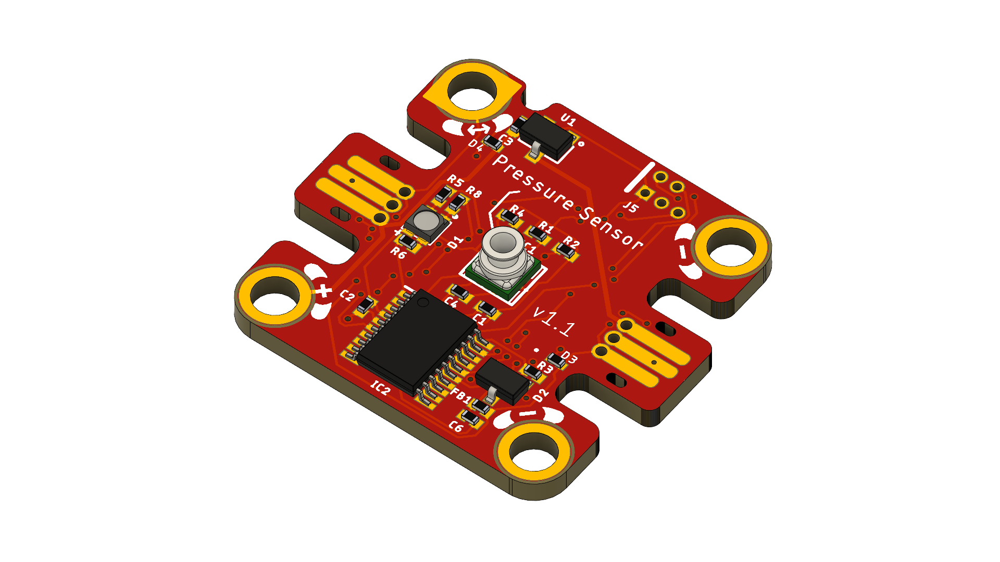
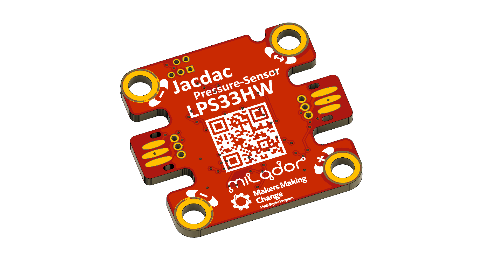

# Jacdac-Pressure-Sensor
A <a href="https://microsoft.github.io/jacdac-docs/">Jacdac</a> Pressure Sensor Module based on <a href="https://www.st.com/en/mems-and-sensors/lps33hw.html">LPS33HW</a> Absolute digital Pressure Sensor.

## Jacdac Dashboard: 

## Top View: 

## Bottom View:

